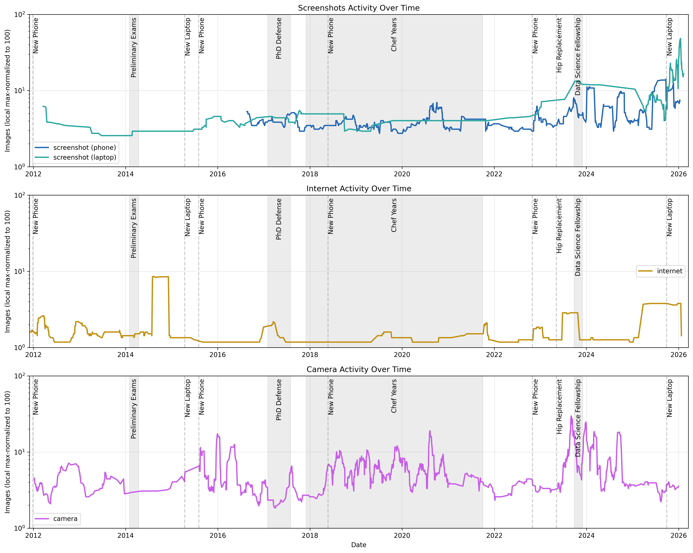
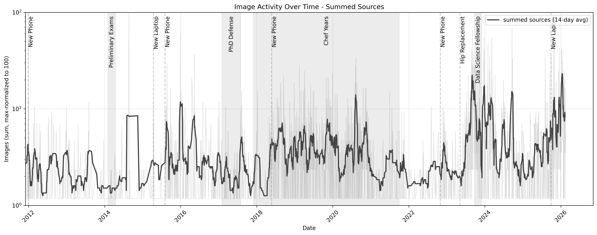
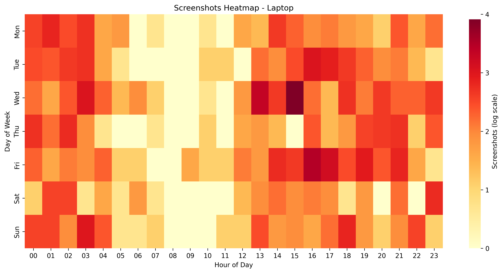
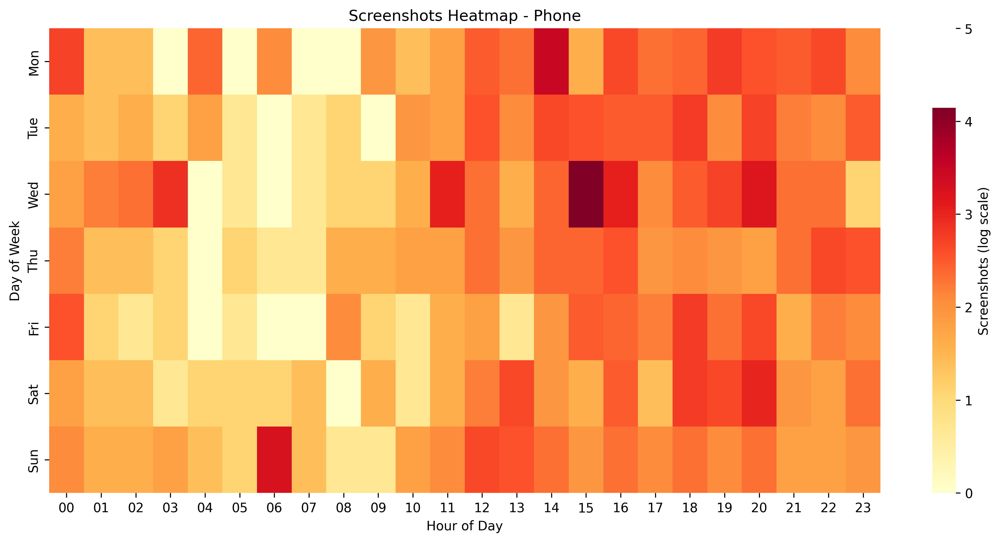
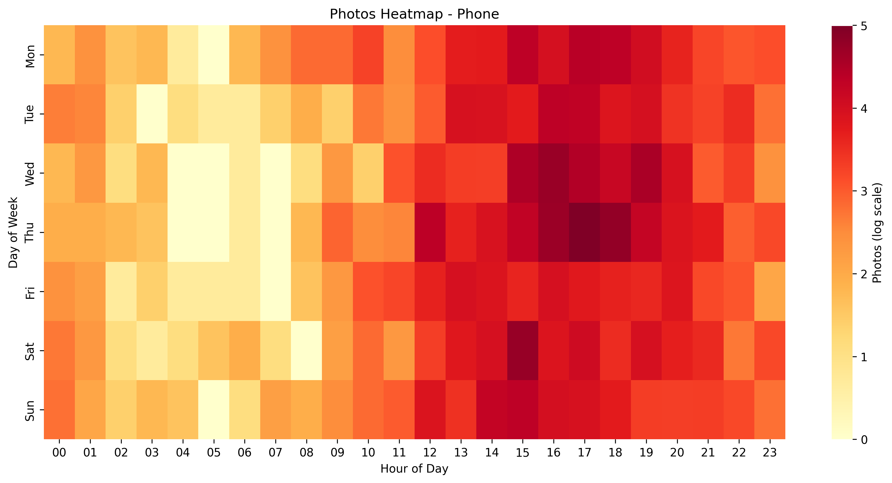
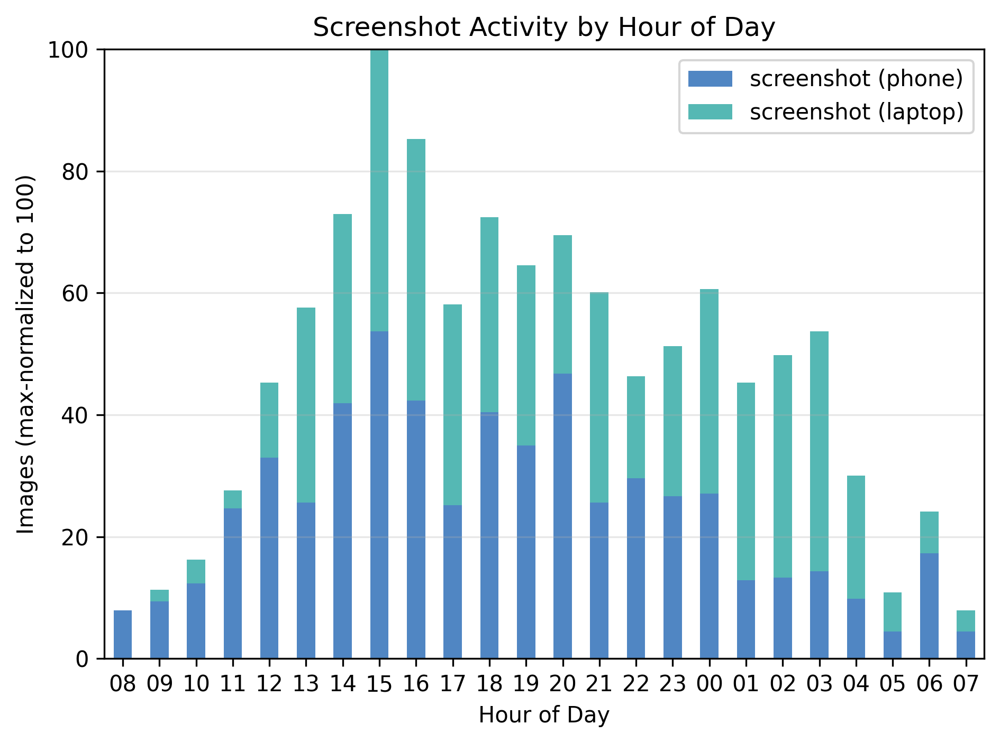
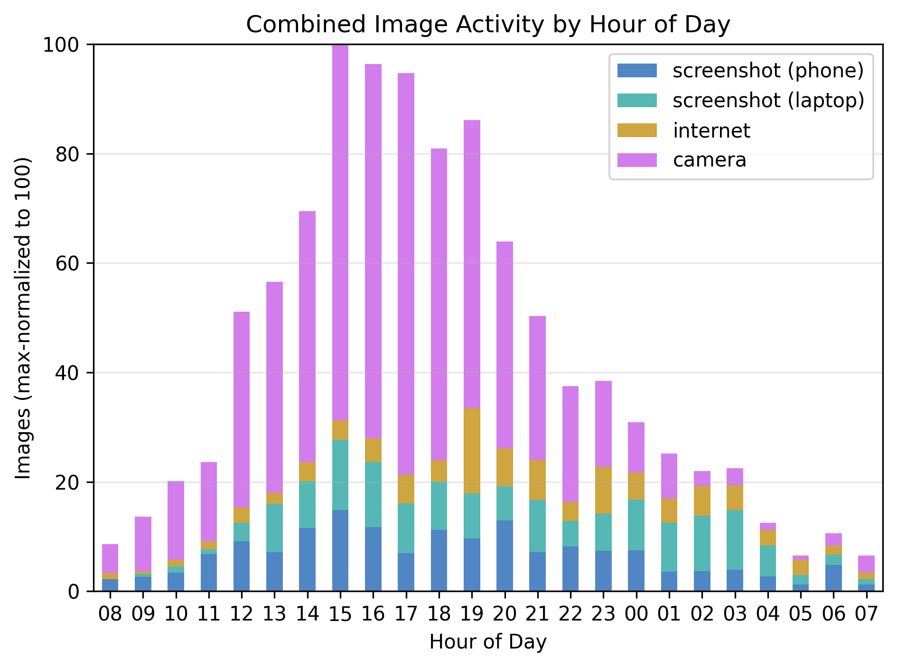
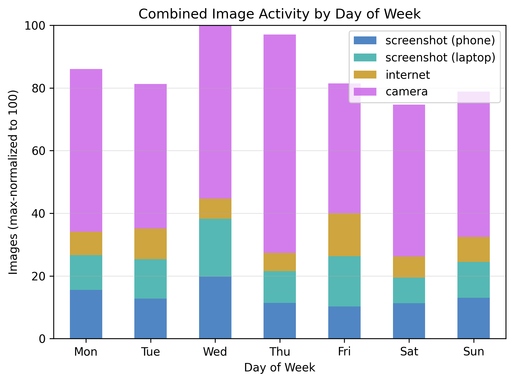
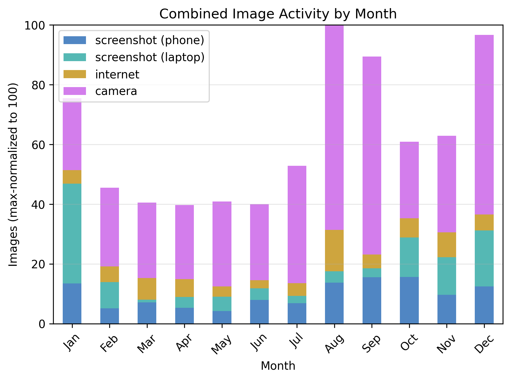

# **brūki** · Image Charts & Tagging

Brūki helps you explore habits and trends across your image collections. It uses machine learning to help you tag and filter screenshots (recipes, receipts, chats and more) through your browser.

## Setup

```bash
git clone https://github.com/brege/bruki
cd bruki && uv sync # [--extra notebook --extra ml]
```

Configure all image sources in `config.yaml`. See [Configuration](#configuration)
```yaml
cp config.example.yaml config.yaml
```

## 1) Charts

- Generate heatmaps, histograms, and trends of image activity over time
- Fine grained image discovery modified-times, EXIF, regex, etc.
- Mark major life events and device chases in charts

```bash
uv run activity
```

### Questions

- do I tend to take more pictures during certain times of year?
- how has my screenshot usage evolved over the last 15 years?
- do I have "honeymoon" periods after a device purchase?
- in what ways has my camera and screenshot usage changed between being an academic, chef, and developer?

My reference image collection broadly fits in three main buckets.

1. **camera** photos from my phone
2. **screenshots** from both my laptop and my phone
3. **internet** pictures downloaded from the internet

See my blog post [brege.org/image-activity](https://brege.org/post/image-activity/) for in-depth insights of the following charts.

### Screenshot vs. Camera vs. Internet Trends



### Image Capture Concurrency



### Heatmap: Desktop Screenshots, Phone Screenshots, and Camera

<table>
  <tr>
    <td></td>
    <td></td>
    <td></td>
  </tr>
</table>

### Hourly Histograms: Device Activity vs. All Sources

<table>
  <tr>
    <td></td>
    <td></td>
  </tr>
</table>

### Daily and Monthly Histograms: All Sources

<table>
  <tr>
    <td></td>
    <td></td>
  </tr>
</table>

## 2) Screenshot Tagging

- Use machine learning techniques to categorize thousands of screenshots in minutes
- Interactively annotate screenshots with machine learning through your browser

A [Jupyter notebook](classify.ipynb) is available for Machine Learning analysis using
- **OCR** via [tesseract](https://github.com/UB-Mannheim/tesseract),and
- **CLIP** from [OpenAI](https://github.com/openai/CLIP)

```bash
uv sync --extra ml --extra notebook
```

1. Generate a reproducible screenshot sample to annotate with manual labels.
   ```bash
   uv run bruki/samples.py --seed 42 --samples 100
   ```
2. Launch the labeling app and label the sample.
   ```bash
   uv run www --sample
   ```
   Then open http://localhost:5000.
3. The notebook analysis compares your manual labels with OCR and CLIP clustering.
   ```bash
   jupyter notebook classify.ipynb
   ```

The Jupyter notebook ([classify.ipynb](classify.ipynb)) performs the following analysis:

1. Tesseract > extraction of OCR tokens > Jaccard similarity > cluster vs. label
2. CLIP > extraction of image embeddings > cosine similarity > heatmap cluster vs. label

based on the `samples.py` sample in `data/notebook/`.

The web app generates an isolated dataset from the Jupyter notebook:

* labels in `data/server/labels.jsonl`
* OCR, CLIP embeddings, etc. in `data/server/state.sqlite3`

### Labeled Screenshots UMAP Clusters using CLIP


###  Jaccard Similarity of Cluster OCR Vocabulary vs Manual Labels


### CLIP Cluster Vote vs Manual Labels


See [classify.ipynb](classify.ipynb) for full analysis. In short: CLIP is more accurate, faster, but OCR provides more fuzz for multi-labeling.

The web app currently includes only CLIP clustering in the backend. OCR will be useful to make search more robust and to provide additional suggestions.

## Configuration

> [!NOTE] 
> The examples here uses Camera sources. Screenshot sources are configured the exact same way.

### 1. sources
These are local paths to image directories:
```yaml
data:
  camera:
    label: camera
    color: "#c95de8"
    methods:
      - exif-created
      - timestamp
      - modified-time
    sources:
      phone:
        path: ~/Syncthing/Phone/DCIM/Camera
      laptop:
        path: ~/Pictures/Camera
```

### 2. plotting
Specify figures for each analysis key (`--key`)
```yaml
plots:
  camera:
    series:
      - camera
    title: Camera Activity
    value_label: Photos
    figures:
      - kind: heatmap_per_source
        series_key: source
    events:
      - phd_defense
```

### 3. major events
Direct marker/band definitions.
```yaml
events:
  phd_defense:
    type: band
    after: 2017-02-01
    before: 2017-07-31
    label: PhD Defense
```

## License

[GPLv3](https://www.gnu.org/licenses/gpl-3.0.en.html)
