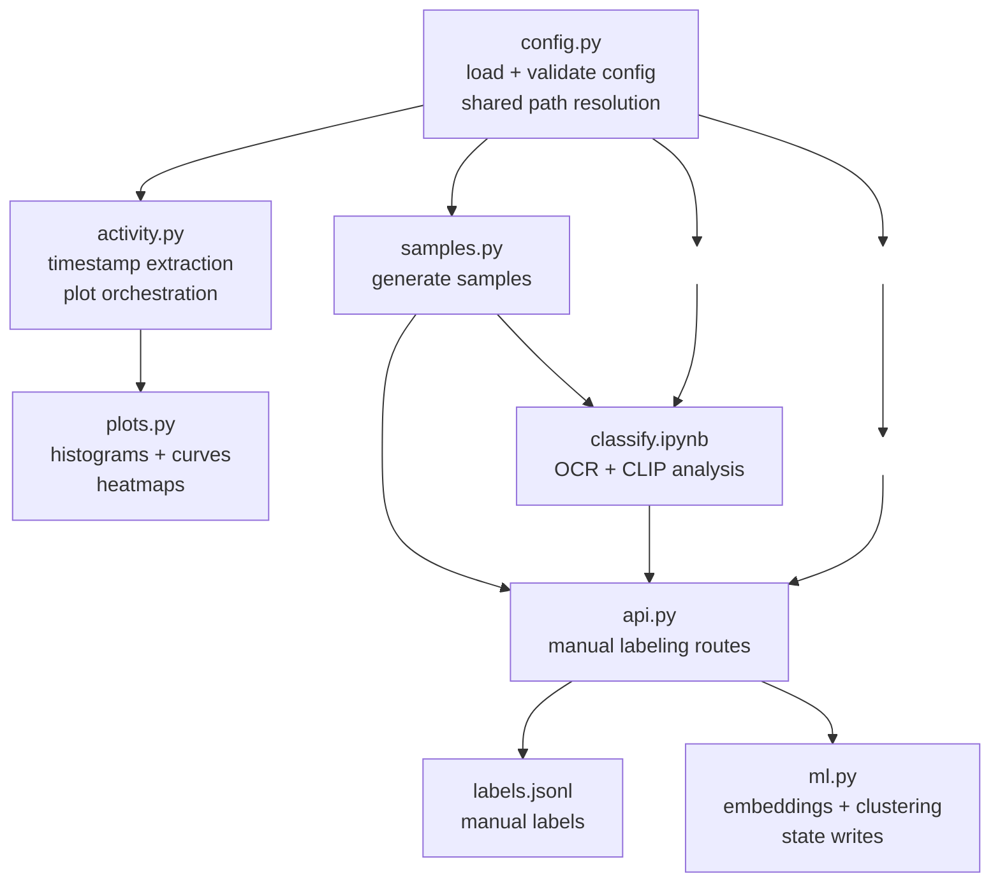

## Contributing

### Linters / Formatters

<table>
  <thead>
    <tr>
      <th>Formatter</th>
      <th>Extension</th>
      <th>Description</th>
    </tr>
  </thead>
  <tbody>
    <tr>
      <td><a href="https://github.com/kynan/nbstripout"><b>nbstripout</b></a></td>
      <td><code>.ipynb</code></td>
      <td>ensures Jupyter notebook output cells aren't committed</td>
    </tr>
    <tr>
      <td><a href="https://github.com/nbQA-dev/nbQA"><b>nbqa</b></a></td>
      <td><code>.ipynb</code></td>
      <td>Jupyter notebook linter and formatter</td>
    </tr>
    <tr>
      <td><a href="https://github.com/astral-sh/ruff"><b>ruff</b></a></td>
      <td><code>.py</code></td>
      <td>general purpose python linter and formatter</td>
    </tr>
    <tr>
      <td><a href="https://github.com/astral-sh/ty"><b>ty</b></a></td>
      <td><code>.py</code></td>
      <td>static type checker</td>
    </tr>
    <tr>
      <td><a href="https://github.com/biomejs/biome"><b>biome</b></a></td>
      <td><code>.js</code>, <code>.css</code>, <code>.html</code></td>
      <td>formats client-side code</td>
    </tr>
  </tbody>
</table>

[ruff](https://github.com/charliermarsh/ruff) is excellent, but it's too opinionated for Jupyter notebooks. [nbqa](https://github.com/nbQA-dev/nbQA) has relaxed alignment rules that cannot be configured in Ruff--specifically: aligning code blocks on equal signs.

### Architecture

> [!WARNING] 
> Work-in-progress and may be out-of-date. 

`config.py` owns config loading and shared path resolution. `activity.py` and `samples.py` are CLIs. `ml.py` is a library used by `api.py`. `classify.ipynb` reads labels and evaluates OCR/CLIP workflows.

### Code conventions
- Typed dataclasses for structured data. `dict[str, Any]` only for genuinely open-ended config blobs.
- String-keyed dispatch tables for routing by type or kind.
- File-backed data (JSONL, labels) is cached by fingerprint or mtime. Avoid adding per-request reads.
- Progress/status writes in loops are throttled by count and time. Avoid writing on every iteration.
- Config validation is strict and happens at load time. Unknown references raise immediately.

### Tools

- [**pydantic**](https://github.com/pydantic/pydantic) is the config contract. All YAML input is validated through `ConfigModel` at load time. Do not re-validate or re-parse config downstream.

- [**pandas**](github.com/pandas-dev/pandas) is the data layer for anything involving image records, timestamps, or aggregations in the notebook, and sometimes in the app code. Manipulate JSON structures through and around the Flask API code only.
